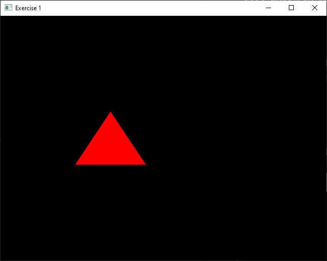
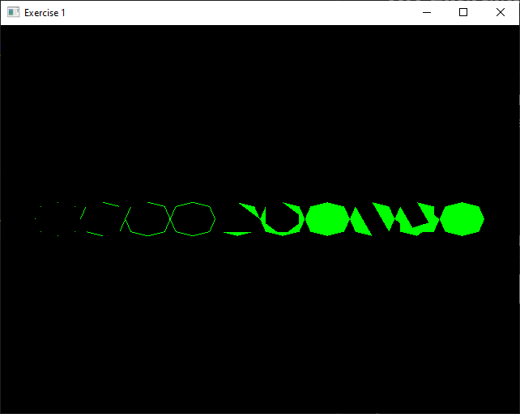

# XR Exercise 1 & 2

## Contents
- Exercise 1
- Exercise 2

Tasks in exercise 1 are solved as two separate functions:
- void exercise1a(void)
- void exercise1b(void)

Tasks in exercise 2 are solved as one larger task, as they build on each other.
Relevant functions:
- void drawCube(style)
- void render()

## Preview of solution to Exercis 1

## Preview of solution to Exercis 2
